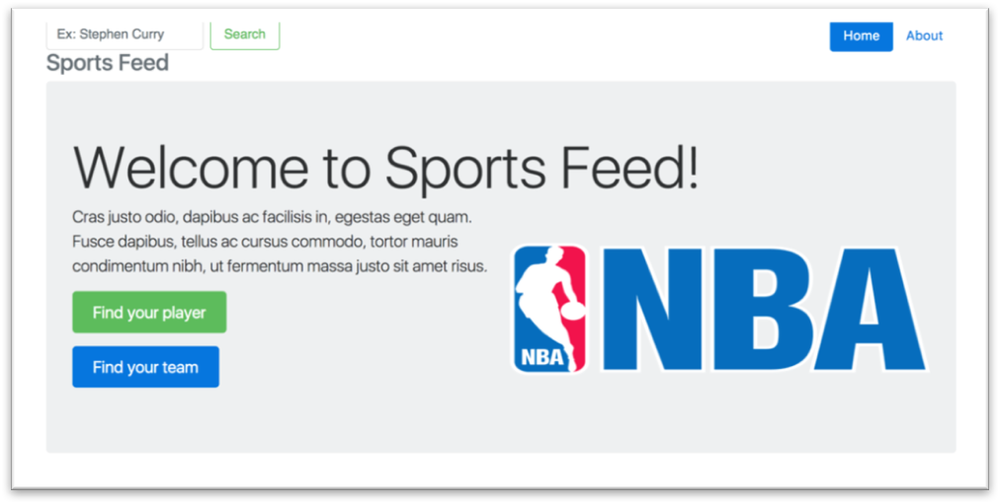
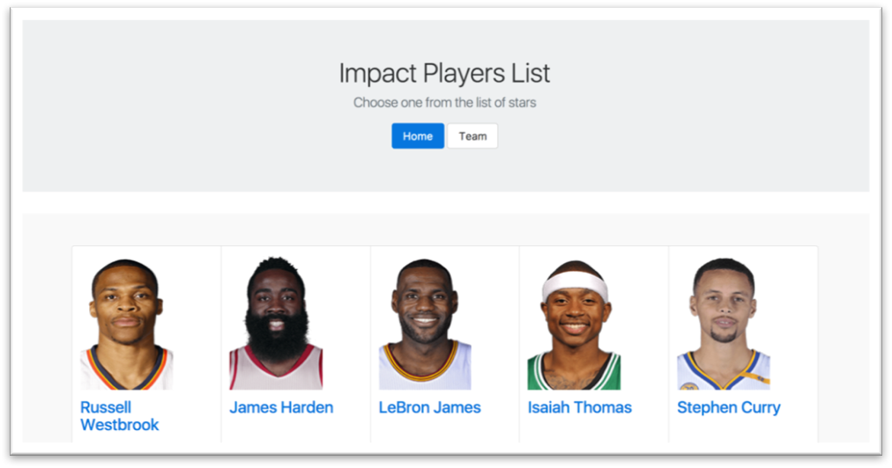
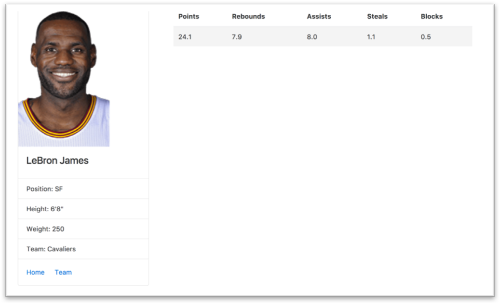
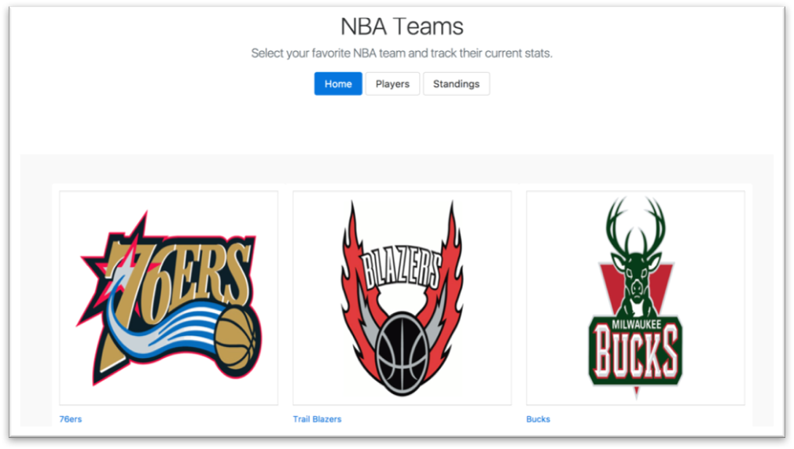

# WebSportsFeed
This website is made for NBA fans to access real-time statistics. You can start from either team or player, or utilize the search bar. Our player list is made of top 30 players in the league by applying impact factors, but there's more you can explore!

[Website](https://nbafeeds.herokuapp.com/)

* WebSportsFeed is a web application where users can browse and search statistics for specified players and teams.  
**Search bar:** type your input here (“Stephen Curry”, ”Lakers”, teams, standing, player). The name of a team or player is not case-sensitive.

* Choose “Find your player” and you can see a list of top 30 impact players based on our weighting formula.

Click on the player’s name and you will be directed to the player’s page with his real-time statistics.

* Choose “Find your team” and you can see a list of all teams in NBA.

  * Click on the name of your chosen team and you will be directed to the team’s page. At this page, you can see the top players of this team in different categories as well as other links, such as search bar, team schedule and league standings for your further browsing.
